# AWS Architecture Expertise Diagram

```mermaid
graph TB
    %% Main Expertise Areas
    subgraph "🏗️ Multi-Region Architectures"
        MR1[Primary Region<br/>us-east-1]
        MR2[Secondary Region<br/>us-west-2]
        MR3[Disaster Recovery<br/>eu-west-1]
        
        MR1 -->|Route 53<br/>Global Load Balancer| MR2
        MR2 -->|Cross-Region<br/>Replication| MR3
        MR1 -->|S3 Cross-Region<br/>Replication| MR2
        MR2 -->|RDS Multi-AZ<br/>Read Replicas| MR3
    end
    
    subgraph "⚡ Serverless Solutions"
        SL1[API Gateway]
        SL2[Lambda Functions]
        SL3[EventBridge]
        SL4[DynamoDB]
        SL5[SQS/SNS]
        
        SL1 -->|HTTP Requests| SL2
        SL3 -->|Events| SL2
        SL2 -->|Data Operations| SL4
        SL2 -->|Messages| SL5
        SL5 -->|Triggers| SL2
    end
    
    subgraph "🔒 Security-First Design"
        SEC1[IAM & SSO]
        SEC2[VPC & Security Groups]
        SEC3[KMS & Secrets Manager]
        SEC4[WAF & Shield]
        SEC5[CloudTrail & Config]
        
        SEC1 -->|Authentication| SEC2
        SEC2 -->|Network Security| SEC3
        SEC3 -->|Encryption| SEC4
        SEC4 -->|DDoS Protection| SEC5
        SEC5 -->|Compliance| SEC1
    end
    
    subgraph "💰 Cost-Optimized Solutions"
        COST1[Reserved Instances]
        COST2[Auto Scaling]
        COST3[Storage Lifecycle]
        COST4[Cost Explorer]
        COST5[Budget Alerts]
        
        COST1 -->|Predictable Costs| COST2
        COST2 -->|Right-sizing| COST3
        COST3 -->|Tiered Storage| COST4
        COST4 -->|Cost Analysis| COST5
        COST5 -->|Spend Control| COST1
    end
    
    subgraph "📊 Observability"
        OBS1[CloudWatch]
        OBS2[X-Ray Tracing]
        OBS3[CloudTrail Logs]
        OBS4[Custom Metrics]
        OBS5[Alerting & SNS]
        
        OBS1 -->|Metrics Collection| OBS2
        OBS2 -->|Distributed Tracing| OBS3
        OBS3 -->|Audit Logs| OBS4
        OBS4 -->|Business KPIs| OBS5
        OBS5 -->|Real-time Alerts| OBS1
    end
    
    %% Cross-cutting concerns
    subgraph "🔄 Integration & Automation"
        AUTO1[CI/CD Pipeline]
        AUTO2[Infrastructure as Code]
        AUTO3[Automated Testing]
        AUTO4[Deployment Strategies]
        
        AUTO1 -->|GitHub Actions| AUTO2
        AUTO2 -->|Terraform/CDK| AUTO3
        AUTO3 -->|Blue-Green| AUTO4
        AUTO4 -->|Canary Deployments| AUTO1
    end
    
    %% Styling
    classDef multiRegion fill:#e1f5fe,stroke:#01579b,stroke-width:2px
    classDef serverless fill:#f3e5f5,stroke:#4a148c,stroke-width:2px
    classDef security fill:#ffebee,stroke:#c62828,stroke-width:2px
    classDef costOptimization fill:#e8f5e8,stroke:#2e7d32,stroke-width:2px
    classDef observability fill:#fff3e0,stroke:#ef6c00,stroke-width:2px
    classDef automation fill:#fce4ec,stroke:#ad1457,stroke-width:2px
    
    class MR1,MR2,MR3 multiRegion
    class SL1,SL2,SL3,SL4,SL5 serverless
    class SEC1,SEC2,SEC3,SEC4,SEC5 security
    class COST1,COST2,COST3,COST4,COST5 costOptimization
    class OBS1,OBS2,OBS3,OBS4,OBS5 observability
    class AUTO1,AUTO2,AUTO3,AUTO4 automation
```

## Architecture Expertise Overview

This diagram illustrates the five core areas of AWS architecture expertise:

### 🏗️ Multi-Region Architectures
- **High Availability**: Primary and secondary regions with automatic failover
- **Disaster Recovery**: Cross-region replication and backup strategies
- **Global Load Balancing**: Route 53 for traffic distribution
- **Data Consistency**: Multi-region database replication

### ⚡ Serverless Solutions
- **Event-Driven Architecture**: EventBridge for decoupled communication
- **Auto-Scaling**: Lambda functions that scale automatically
- **API-First Design**: API Gateway for RESTful and GraphQL APIs
- **Message Queuing**: SQS/SNS for asynchronous processing

### 🔒 Security-First Design
- **Zero Trust**: IAM and SSO for identity management
- **Network Security**: VPC and security groups for isolation
- **Encryption**: KMS and Secrets Manager for data protection
- **Compliance**: CloudTrail and Config for audit trails

### 💰 Cost-Optimized Solutions
- **Reserved Instances**: Long-term cost savings for predictable workloads
- **Auto Scaling**: Right-sizing based on demand
- **Storage Optimization**: Lifecycle policies for cost-effective storage
- **Cost Monitoring**: Real-time cost tracking and alerts

### 📊 Observability
- **Comprehensive Monitoring**: CloudWatch for metrics and logs
- **Distributed Tracing**: X-Ray for request tracking
- **Custom Metrics**: Business KPIs and application metrics
- **Real-time Alerting**: Proactive issue detection and notification

### 🔄 Integration & Automation
- **CI/CD Pipelines**: Automated deployment workflows
- **Infrastructure as Code**: Terraform and AWS CDK
- **Testing Automation**: Automated testing and validation
- **Deployment Strategies**: Blue-green and canary deployments
